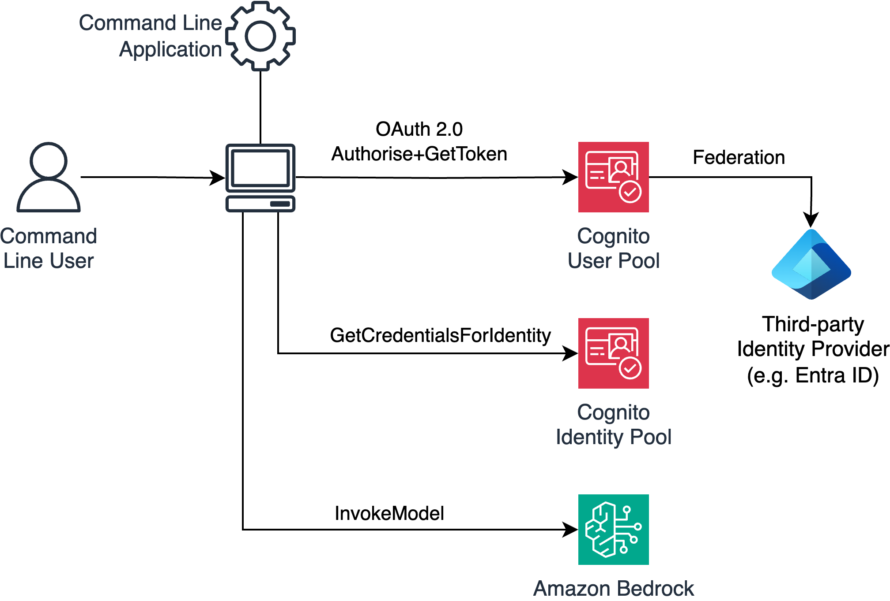
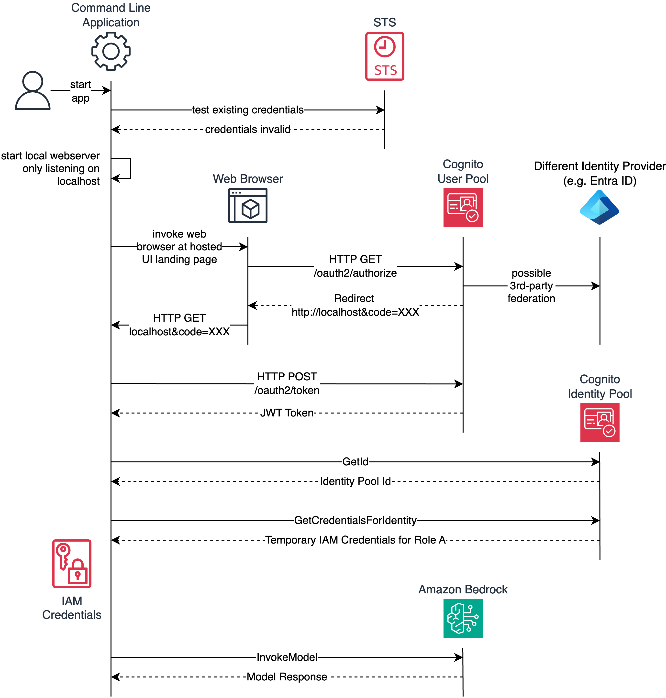
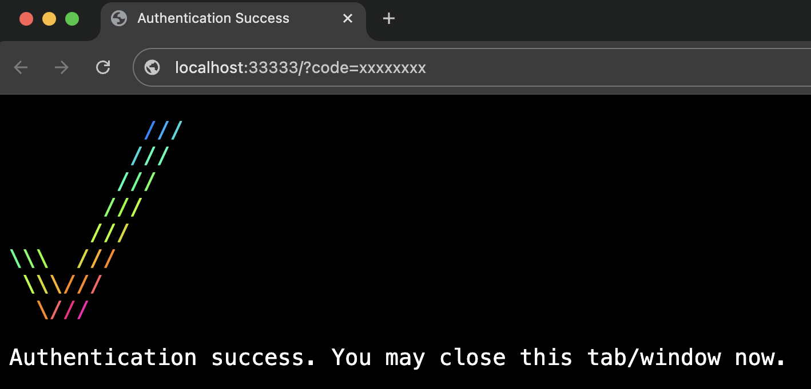

# GenAI Command Line App Example

This repository contains a very basic example command line application that utilises Amazon Bedrock. The intent is to serve as a basis for building command-line oriented tools on top of Large Language Models on Amazon Bedrock. Command line tools are often preferred by developers as they can be easily integrated into team workflows.

This example shows how to solve the problem of enterprise OAuth 2.0 authentication for command line applications.

## Table of Contents

1. [How it works](#About)
2. [License](#License)

## How it works <a name="About"></a>



Let's work backwards from the goal which is to have our command line tool call the Amazon Bedrock service to generate some content. Like most AWS APIs, Bedrock API are protected by the AWS [SigV4](https://docs.aws.amazon.com/IAM/latest/UserGuide/reference_aws-signing.html) signing protocol. The AWS SDK takes care of signing requests for us, but we need credentials for an IAM Role that has permission to call the Amazon Bedrock service.

To get temporary IAM credentials we use the Amazon Cognito Identity Pool service. By calling the AWS GetCredentialsForIdentity web service we can get these credentials. However, we must have an identity that Cognito knows about.

In this example we are using Cognito User Pool as our Identity provider, but you can use any other compliant OIDC Identity Provider. The Cognito User Pool service supports a hosted web-based UI to sign in our command line user.

In a typical enterprise scenario, you would likely federate the Cognito Identity Pool directly to another Identity Provider that the organisation is using such as Okta or Entra ID - or a Cognito User Pool can be used as an interstitial a user store which caches identity information from an upstream provider again like Okta or Entra ID.

This is an extremely common pattern for Web Apps. In summary, a user signs in using an OIDC flow, and then swaps the Access Token for temporary least-priviledged IAM credentials and calls AWS Services. See the following section for an example policy.

This example however is not a Web Application - it is a command line application. So how do we participate in the OIDC authentication flow which is web-based and uses HTTP Redirects?

We solve this by starting a minimal web server inside the command line application which is secure as it only listens on the Localhost loopback interface 127.0.0.1. That enables us to open the Mac, Linux or Windows web browser and point it at the Cognito Hosted UI Sign-in page. After authentication is complete, Cognito will redirect the browser back to http://127.0.0.1:33333 and pass the authorisation code. In the minimal web server implementation, we can capture that authorisation code and then complete the rest of the OIDC flow using any compliant OIDC implementation. In this case we have used `simple-oauth2`.





## Example Policy for invoking a Bedrock Model

Here is an example policy that you can use with your IAM Role above to allow that role to invoke an LLM (Claude in this case) only.

```
{
    "Version": "2012-10-17",
    "Statement": [
        {
            "Effect": "Allow",
            "Action": [
                "bedrock:InvokeModel"
            ],
            "Resource": "arn:aws:bedrock:ap-southeast-2:XXXXXXXXXXXXX:foundation-model/anthropic.claude-3-sonnet-20240229-v1:0"
        }
    ]
}
```

## License <a name="License"></a>

This example is licensed under the MIT-0 License.

## Security

See CONTRIBUTING for more information.
